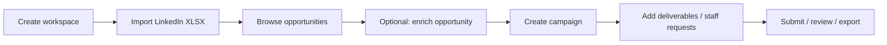

# PostBloom API — Frontend Reference

**Version:** 0.1.0  
**Base URL (local):** `http://localhost:3000`  
**API prefix:** `/api/v1` (except health)

This document is the **canonical contract** for frontend integration. It is kept in sync with the backend route definitions and Zod validators.

| Resource | URL |
|----------|-----|
| Interactive docs (Swagger UI) | http://localhost:3000/api/docs |
| OpenAPI JSON (codegen, Postman) | http://localhost:3000/api/docs/openapi.json |
| This guide | [`docs/API.md`](API.md) |

When you change an endpoint, update **both** the route `@openapi` JSDoc block and this file, then run `npm run docs:check` in `backend/`.

---

## Table of contents

1. [Conventions](#conventions)
2. [Authentication](#authentication)
3. [Authorization (RBAC)](#authorization-rbac)
4. [Onboarding flow](#onboarding-flow)
5. [Endpoints](#endpoints)
6. [Data models](#data-models)
7. [Workflows](#workflows)
8. [Platform templates](#platform-templates)
9. [Notifications](#notifications)
10. [Error codes](#error-codes)
11. [Demo accounts](#demo-accounts)

---

## Conventions

### Request format

- **JSON bodies:** `Content-Type: application/json`
- **File upload:** `multipart/form-data` with field name `file` (LinkedIn XLSX only)
- **Auth (protected routes):** `Authorization: Bearer <JWT>`

### Response envelope

Successful responses wrap payloads in `data`:

```json
{ "data": { ... } }
```

Errors use a separate shape (no `data` wrapper):

```json
{
  "error": {
    "code": "VALIDATION_ERROR",
    "message": "invalid register data",
    "details": [{ "field": "password", "message": "String must contain at least 8 character(s)" }]
  }
}
```

`details` is only present for validation errors (`422`).

### Identifiers

| Context | ID to use |
|---------|-----------|
| URL path params (`workspaceId`, `campaignId`, `deliverableId`, `opportunityId`, `importId`, notification `id`) | **`publicUuid`** (UUID string) |
| Admin `userId` path param | User **`publicUuid`** |
| Response field `id` on `User` | Internal numeric ID — **do not** put in URLs; prefer `publicUuid` when exposed |

All path UUIDs must be valid RFC 4122 UUIDs.

### Dates

- Request bodies: ISO 8601 **date** strings (`YYYY-MM-DD`) for `dueDate`
- Responses: ISO 8601 **date-time** (`createdAt`, `enrichedAt`, etc.)

### CORS

CORS is enabled for all origins in development.

---

## Authentication

### Register

`POST /api/v1/auth/register` — **no auth**

**Body**

| Field | Type | Required |
|-------|------|----------|
| `email` | string (email) | yes |
| `password` | string (min 8) | yes |
| `displayName` | string (1–255) | yes |

**Response `201`**

```json
{
  "data": {
    "user": { "id": 1, "publicUuid": "…", "email": "…", "displayName": "…", "accountRole": "user", "createdAt": "…" },
    "token": "<JWT>"
  }
}
```

**Errors:** `409 EMAIL_EXISTS`, `422 VALIDATION_ERROR`

New users receive `accountRole: "user"` and may create workspaces.

---

### Login

`POST /api/v1/auth/login` — **no auth**

**Body:** `{ "email", "password" }`

**Response `200`:** same shape as register (`user` + `token`).

**Errors:** `401 INVALID_CREDENTIALS`, `422 VALIDATION_ERROR`

---

### Current user

`GET /api/v1/auth/me` — **auth required**

**Response `200`:** `{ "data": <User> }`

**Errors:** `401 UNAUTHORIZED`, `404 NOT_FOUND`

Store `token` in memory or secure storage; send on every protected request.

---

## Authorization (RBAC)

Authorization uses **global account roles** on the user plus **workspace membership** (any member can access that workspace’s resources if their role grants the permission).

### Account roles

| `accountRole` | Create workspace | Typical UI |
|---------------|------------------|------------|
| `user` | Yes | Owner / operator: import, campaigns, staffing |
| `admin` | Yes | Platform admin + all operator capabilities |
| `writer` | No | My work, submit copy, comment |
| `designer` | No | My work, submit via `externalUrl`, comment |
| `reviewer` | No | Review queue, review actions, comment |

### Permission codes (workspace-scoped)

Checked via `requirePermission` on workspace routes and `requireCampaignPermission` on campaign/deliverable routes (after resolving workspace from campaign/deliverable).

| Code | Roles with permission |
|------|------------------------|
| `workspace:create` | `user`, `admin` |
| `workspace:manage` | `admin` only |
| `analytics:import` | `user`, `admin` |
| `opportunity:enrich` | `user`, `admin` |
| `campaign:create` | `user`, `admin` |
| `campaign:view` | `user`, `admin`, `writer`, `designer`, `reviewer` |
| `deliverable:submit` | `writer`, `designer`, `admin` |
| `deliverable:review` | `reviewer`, `admin` |
| `deliverable:comment` | all specialist roles + `user`/`admin` via campaign view |
| `audit:view` | `user`, `admin`, `reviewer` |

### Platform admin

Routes under `/api/v1/admin/*` require `accountRole === "admin"` (`requirePlatformAdmin`).

### Review rules

- If a deliverable has `reviewer_id` set, only that user (or `admin`) can call review.
- If **no** reviewer is assigned, the **campaign owner** (`user`/`admin` with `campaign:create`) may review (self-review).
- `reviewer` account role cannot review unless they are the assigned `reviewer_id`.

### Submit rules

- **Writer:** assigned as `assignee_id`; submits `payload` matching platform `fieldSchema`.
- **Designer:** assigned as `designer_id` (or `assignee_id` when no designer); submits `{ "externalUrl": "https://…" }` only.
- **Admin:** may submit either form.

---

## Onboarding flow

Per workspace, the UI should enforce this order:



1. `POST /api/v1/workspaces` — only `user` or `admin`
2. `POST /api/v1/workspaces/:workspaceId/analytics/import` — XLSX upload
3. `GET /api/v1/workspaces/:workspaceId` — read `setup.hasImport` and `setup.canCreateCampaign`
4. `POST /api/v1/workspaces/:workspaceId/campaigns` — blocked with `422 WORKSPACE_NOT_READY` until step 2 completes

Specialists join via **staff request accept** only (no manual assign API).

---

## Endpoints

### System

#### Health check

`GET /health` — **no auth**

```json
{ "data": { "status": "ok", "service": "postbloom-api" } }
```

---

### Workspaces

#### List workspaces

`GET /api/v1/workspaces` — auth

**Response `200`:** array of workspace list items (see [WorkspaceListItem](#workspacelistitem)).

#### Create workspace

`POST /api/v1/workspaces` — auth, `user` or `admin` only

**Body**

| Field | Type | Required |
|-------|------|----------|
| `name` | string | yes |
| `slug` | string | no (auto-generated from name) |

**Response `201`:** `{ "data": <Workspace> }`

**Errors:** `403 FORBIDDEN`, `409 SLUG_EXISTS`, `422`

#### Get workspace

`GET /api/v1/workspaces/:workspaceId` — auth, must be member

**Response `200`:** workspace + setup flags:

```json
{
  "data": {
    "id": 1,
    "publicUuid": "…",
    "name": "My Workspace",
    "slug": "my-workspace",
    "createdAt": "…",
    "setup": {
      "hasImport": true,
      "canCreateCampaign": true
    }
  }
}
```

#### List members

`GET /api/v1/workspaces/:workspaceId/members` — auth, member

**Response `200`:** array of [WorkspaceMember](#workspacemember).

---

### Analytics

All routes: `requirePermission("analytics:import")`.

#### Import LinkedIn XLSX

`POST /api/v1/workspaces/:workspaceId/analytics/import` — auth

**Body:** `multipart/form-data`, field **`file`** (`.xlsx`, max 10 MB default)

**Response `201`**

```json
{
  "data": {
    "importPublicUuid": "…",
    "postsImported": 42,
    "warnings": [],
    "dateRange": { "start": "2025-01-01", "end": "2025-03-31" },
    "discovery": {},
    "topPosts": [
      {
        "linkedinPostUrl": "https://…",
        "score": 85.2,
        "rank": 1,
        "recommendationLabel": "High-performing vs your imported LinkedIn posts — …"
      }
    ]
  }
}
```

**Errors:** `404`, `403`, `422 INVALID_XLSX` (parser), `422` if file missing

#### List imports

`GET /api/v1/workspaces/:workspaceId/analytics/imports`

**Response `200`:** array of import summaries (DB shape: `public_uuid` → use `publicUuid` if mapped; list endpoint returns raw rows — fields: `public_uuid`, `original_filename`, `date_range_start`, `date_range_end`, `row_counts`, `warnings`, `created_at`). Prefer **import summary** endpoint for UI.

#### Import summary

`GET /api/v1/workspaces/:workspaceId/analytics/imports/:importId`

**Response `200`**

```json
{
  "data": {
    "publicUuid": "…",
    "originalFilename": "export.xlsx",
    "dateRangeStart": "…",
    "dateRangeEnd": "…",
    "rowCounts": {},
    "warnings": [],
    "discoverySummary": {},
    "createdAt": "…"
  }
}
```

---

### Opportunities

Base: `/api/v1/workspaces/:workspaceId/opportunities`  
Permission: `analytics:import` for list/get; `opportunity:enrich` for patch.

#### List opportunities

`GET /api/v1/workspaces/:workspaceId/opportunities?sort=score|date`

| Query | Default | Description |
|-------|---------|-------------|
| `sort` | `score` | `score` → rank ascending; `date` → publish date descending |

**Response `200`:** array of [Opportunity](#opportunity).

#### Get opportunity

`GET /api/v1/workspaces/:workspaceId/opportunities/:opportunityId`

**Response `200`:** single [Opportunity](#opportunity).

#### Enrich opportunity

`PATCH /api/v1/workspaces/:workspaceId/opportunities/:opportunityId/enrich`

**Body**

| Field | Required |
|-------|----------|
| `title` | yes |
| `excerpt` | no |
| `notes` | no |

**Response `200`:** updated [Opportunity](#opportunity).

---

### Campaigns & deliverables

#### List platform templates

`GET /api/v1/platforms` — auth

**Response `200`:** array of [PlatformType](#platformtype). Use when building create-campaign or add-deliverable UI.

#### Create campaign

`POST /api/v1/workspaces/:workspaceId/campaigns` — `campaign:create`

**Body**

| Field | Type | Required |
|-------|------|----------|
| `opportunityUuid` | UUID | yes (source post `publicUuid`) |
| `name` | string | yes |
| `platformCodes` | string[] | yes (e.g. `["instagram_carousel","youtube_short"]`) |
| `dueDate` | date | no |

Creates campaign in `active` status and one deliverable per platform (status `assigned`).

**Response `201`**

```json
{
  "data": {
    "publicUuid": "…",
    "name": "Q1 Carousel Push",
    "deliverableCount": 2
  }
}
```

**Errors:** `422 WORKSPACE_NOT_READY`, `422 INVALID_PLATFORM`, `404` (bad opportunity uuid)

#### List campaigns

`GET /api/v1/workspaces/:workspaceId/campaigns` — `campaign:view`

**Response `200`:** array of [CampaignListItem](#campaignlistitem).

#### My work

`GET /api/v1/workspaces/:workspaceId/my-work` — `deliverable:submit`

Deliverables where current user is assignee or designer, excluding `ready_to_publish`.

**Response `200`:** array of [MyWorkItem](#myworkitem).

#### Review queue

`GET /api/v1/workspaces/:workspaceId/review-queue` — `deliverable:review`

Deliverables in `submitted_for_review`. For `reviewer` role, filtered to assignments where `reviewer_id` is current user.

**Response `200`:** array of [ReviewQueueItem](#reviewqueueitem).

#### Activity log

`GET /api/v1/workspaces/:workspaceId/activity?entity=<entityType>` — `audit:view`

| Query | Description |
|-------|-------------|
| `entity` | optional filter (`workspace`, `campaign`, `analytics_import`, `source_post`, `deliverable`, …) |

**Response `200`:** array of [AuditEvent](#auditevent) (max 50).

#### Get campaign

`GET /api/v1/campaigns/:campaignId` — `campaign:view` (workspace resolved from campaign)

**Response `200`:** [CampaignDetail](#campaigndetail).

#### Transition campaign status

`POST /api/v1/campaigns/:campaignId/status` — `campaign:create`

**Body:** `{ "statusCode": string, "notes"?: string }`

**Response `200`:** [CampaignDetail](#campaigndetail).

See [Campaign status workflow](#campaign-status-workflow).

#### List deliverables

`GET /api/v1/campaigns/:campaignId/deliverables` — `campaign:view`

**Response `200`:** array of [Deliverable](#deliverable).

#### Add deliverable

`POST /api/v1/campaigns/:campaignId/deliverables` — `campaign:create`, campaign must be `active`

**Body:** `{ "platformCode": string, "title"?: string, "dueDate"?: "YYYY-MM-DD" }`

**Response `201`:** single [Deliverable](#deliverable).

#### Export-ready deliverables

`GET /api/v1/campaigns/:campaignId/export-ready` — `campaign:view`

**Response `200`:** array of:

```json
{
  "publicUuid": "…",
  "title": "…",
  "platformCode": "instagram_carousel",
  "fieldSchema": [ … ],
  "latestVersion": 2,
  "payload": { "carousel_title": "…", … }
}
```

#### Submit version

`POST /api/v1/deliverables/:deliverableId/versions` — `deliverable:submit`

**Body**

| Field | Writer | Designer | Admin |
|-------|--------|----------|-------|
| `payload` | required (matches `fieldSchema`) | must not use alone | optional |
| `externalUrl` | must not use | required (HTTPS URL) | optional |

Transitions deliverable toward `submitted_for_review` (via `in_progress` if needed). Notifies assigned reviewer if set.

**Response `201`**

```json
{
  "data": {
    "publicUuid": "…",
    "versionNo": 1,
    "payload": { … },
    "externalUrl": null
  }
}
```

#### Review deliverable

`POST /api/v1/deliverables/:deliverableId/review` — `deliverable:review` **or** `campaign:create` (owner self-review)

**Body**

```json
{
  "action": "approve" | "request_revision",
  "notes": "optional string"
}
```

**Response `200`:** `{ "data": { "statusCode": "ready_to_publish" | "revision_requested" } }`

`approve` moves to `approved` then `ready_to_publish`. Campaign status may auto-sync.

#### List comments

`GET /api/v1/deliverables/:deliverableId/comments` — `campaign:view`

**Response `200`:** array of [Comment](#comment).

#### Add comment

`POST /api/v1/deliverables/:deliverableId/comments` — `deliverable:comment`

**Body:** `{ "body": string }` (1–5000 chars)

**Response `201`:** [Comment](#comment).

---

### Staffing

Specialists accept broadcast requests; first accept wins.

| Method | Path | Who |
|--------|------|-----|
| `GET` | `/api/v1/campaigns/:campaignId/staff-requests` | campaign viewers |
| `GET` | `/api/v1/deliverables/:deliverableId/staff-requests` | campaign viewers |
| `POST` | `/api/v1/deliverables/:deliverableId/staff-requests` | `campaign:create` |
| `DELETE` | `/api/v1/deliverables/:deliverableId/staff-requests/:roleCode` | `campaign:create`, `roleCode`: `writer` \| `designer` |
| `GET` | `/api/v1/specialist/staff-requests?status=pending` | specialist inbox |
| `POST` | `/api/v1/staff-requests/:requestId/accept` | matching specialist role |

**Create staff request body**

```json
{ "roleCode": "writer" | "designer" | "reviewer" }
```

Optional. If omitted, inferred from platform: `instagram_carousel` / `threads_thread` → `writer`; `youtube_short` / `tiktok_reel` → `designer`. Pass `reviewer` explicitly when needed.

**Response shapes:** [StaffRequest](#staffrequest).

**Accept `200`:** updated assignment + request status (see service response in OpenAPI).

**Errors:** `409 REQUEST_EXISTS`, `409 ROLE_FILLED`, `409 CONFLICT`, `422 NO_SPECIALISTS`, `422 INVALID_STATE`

---

### Notifications

#### List

`GET /api/v1/notifications?unread=true` — auth

| Query | Effect |
|-------|--------|
| `unread=true` | only unread |

**Response `200`:** array of [Notification](#notification) (max 100).

#### Mark read

`PATCH /api/v1/notifications/:id/read` — auth (`id` = notification `publicUuid`)

**Response `200`:** `{ "data": { "ok": true } }`

---

### Admin (platform)

Requires `accountRole: "admin"`.

#### Assign user role

`POST /api/v1/admin/users/:userId/role`

`:userId` = user **`publicUuid`**.

**Body:** `{ "roleCode": "user" | "designer" | "writer" | "reviewer" | "admin" }`

**Response `200`:** `<User>`

Promoting to `admin` demotes the previous admin to `user`.

#### Add user to workspace

`POST /api/v1/admin/users/:userId/workspaces/:workspaceId`

Only **specialist** or **admin** accounts. Adds active workspace membership.

**Response `200`:** array of [WorkspaceMember](#workspacemember).

#### Specialist analytics

`GET /api/v1/admin/analytics/specialists?role=writer|designer|reviewer`

**Response `200`**

```json
{
  "data": [
    {
      "publicUuid": "…",
      "displayName": "…",
      "accountRole": "writer",
      "campaignsParticipated": 5,
      "campaignsCompleted": 3,
      "completionRate": 0.6
    }
  ]
}
```

---

## Data models

### User

```ts
{
  id: number;           // internal — avoid in URLs
  publicUuid: string;
  email: string;
  displayName: string;
  accountRole: "user" | "admin" | "designer" | "writer" | "reviewer";
  createdAt: string;    // ISO date-time
}
```

### Workspace

```ts
{ id: number; publicUuid: string; name: string; slug: string; createdAt: string }
```

### WorkspaceListItem

```ts
{ publicUuid: string; name: string; slug: string; createdAt: string; accountRole: string }
```

### WorkspaceMember

```ts
{
  user: { publicUuid: string; email: string; displayName: string };
  roleCode: string;      // same as accountRole
  accountRole: string;
  status: "active";
  joinedAt: string;
}
```

### Opportunity

```ts
{
  publicUuid: string;
  linkedinPostUrl: string;
  publishDate: string | null;
  impressions: number | null;
  engagements: number | null;
  engagementRate: number | null;
  enrichmentTitle: string | null;
  enrichmentExcerpt: string | null;
  enrichmentNotes: string | null;
  enrichedAt: string | null;
  score: number | null;
  rank: number | null;
  scoreBreakdown: object | null;
  recommendationLabel: string | null;
  importPublicUuid: string;
}
```

### PlatformType

```ts
{
  code: string;           // e.g. "instagram_carousel"
  name: string;
  fieldSchema: FieldDef[];
}

type FieldDef = {
  key: string;
  label: string;
  type: "text" | "textarea";
  required: boolean;
};
```

### CampaignListItem

```ts
{
  publicUuid: string;
  name: string;
  statusCode: string;
  statusName: string;
  enrichmentTitle: string | null;
  createdAt: string;
}
```

### CampaignDetail

```ts
{
  publicUuid: string;
  name: string;
  statusCode: string;
  statusName: string;
  opportunityUuid: string;
  enrichmentTitle: string | null;
  createdAt: string;
  deliverables: Deliverable[];
}
```

### Deliverable

```ts
{
  publicUuid: string;
  title: string;
  statusCode: string;
  platformCode: string;
  platformName: string;
  assigneeName: string | null;
  reviewerName: string | null;
  designerName: string | null;
  dueDate: string | null;
}
```

### MyWorkItem

```ts
{
  public_uuid: string;      // note: snake_case from DB mapper
  title: string;
  status_code: string;
  platform_name: string;
  campaign_public_uuid: string;
  campaign_name: string;
}
```

Frontend may normalize to camelCase locally.

### ReviewQueueItem

Same shape pattern as MyWorkItem (`public_uuid`, `status_code`, …).

### Comment

```ts
{
  publicUuid: string;
  body: string;
  authorName: string;
  authorRole: string;
  createdAt: string;
}
```

### StaffRequest

```ts
{
  publicUuid: string;
  requestScope: "deliverable" | "campaign";
  campaignPublicUuid: string;
  campaignName: string;
  deliverablePublicUuid: string | null;
  deliverableTitle: string | null;
  workspacePublicUuid: string;
  roleCode: "writer" | "designer" | "reviewer";
  status: "pending" | "accepted" | "cancelled";
  requestedByName: string | null;
  acceptedByName: string | null;
  acceptedAt: string | null;
  createdAt: string;
}
```

Specialist inbox may include `workspaceName`.

### AuditEvent

```ts
{
  publicUuid: string;
  entityType: string;
  entityId: number | null;
  entityPublicUuid: string | null;
  action: string;
  metadata: object;
  actorName: string | null;
  createdAt: string;
}
```

### Notification

```ts
{
  publicUuid: string;
  type: string;       // see Notifications
  payload: object;
  readAt: string | null;
  createdAt: string;
}
```

---

## Workflows

### Campaign status workflow

| `statusCode` | Meaning |
|--------------|---------|
| `draft` | Initial (not used on create — campaigns start `active`) |
| `active` | In production |
| `in_review` | At least one deliverable in review/revision |
| `partially_approved` | Mix of approved / in progress |
| `ready_to_publish` | All deliverables ready |
| `completed` | Published / done |
| `cancelled` | Cancelled |

**Allowed transitions** (manual via status endpoint):

```
draft → active, cancelled
active → in_review, cancelled
in_review → partially_approved, active, cancelled
partially_approved → ready_to_publish, in_review, cancelled
ready_to_publish → completed, in_review
completed → (none)
cancelled → (none)
```

Campaign status also **auto-syncs** from deliverable states when submissions/reviews change.

### Deliverable status workflow

| `statusCode` | Meaning |
|--------------|---------|
| `assigned` | Created, awaiting specialist |
| `in_progress` | Specialist accepted / working |
| `submitted_for_review` | Version submitted |
| `revision_requested` | Reviewer requested changes |
| `approved` | Approved (transient before ready) |
| `ready_to_publish` | Approved for export |

**Allowed transitions:**

```
assigned → in_progress
in_progress → submitted_for_review
submitted_for_review → revision_requested | approved
revision_requested → in_progress
approved → ready_to_publish
```

---

## Platform templates

| `platformCode` | Name | Default specialist role |
|----------------|------|-------------------------|
| `instagram_carousel` | Instagram Carousel | `writer` |
| `threads_thread` | Threads / X Thread | `writer` |
| `youtube_short` | YouTube Short | `designer` |
| `tiktok_reel` | TikTok / Instagram Reel | `designer` |

Field schemas are returned on `GET /api/v1/platforms` — build dynamic forms from `fieldSchema` for writer submissions.

---

## Notifications

| `type` | Typical `payload` |
|--------|-------------------|
| `staff_request_open` | campaign/deliverable/workspace UUIDs, `roleCode` |
| `deliverable_submitted` | `deliverablePublicUuid`, `versionNo` |
| `deliverable_approved` | `deliverablePublicUuid`, `notes` |
| `revision_requested` | `deliverablePublicUuid`, `notes` |

Poll `GET /api/v1/notifications?unread=true` or list all and filter client-side.

---

## Error codes

| HTTP | `code` | When |
|------|--------|------|
| 400 | `BAD_REQUEST` | Missing workspace context in middleware |
| 401 | `UNAUTHORIZED` | Missing/invalid JWT |
| 401 | `INVALID_CREDENTIALS` | Login failed |
| 403 | `FORBIDDEN` | Role/permission/membership |
| 404 | `NOT_FOUND` | Resource or route |
| 409 | `EMAIL_EXISTS` | Register duplicate |
| 409 | `SLUG_EXISTS` | Workspace slug taken |
| 409 | `DUPLICATE` | Generic DB unique violation |
| 409 | `REQUEST_EXISTS` | Pending staff request |
| 409 | `ROLE_FILLED` | Role already assigned |
| 409 | `CONFLICT` | Staff request no longer open |
| 409 | `ADMIN_REQUIRED` | Cannot demote last admin |
| 422 | `VALIDATION_ERROR` | Zod validation (`details[]`) |
| 422 | `INVALID_XLSX` | Parser/sheet errors |
| 422 | `INVALID_TRANSITION` | Status transition not allowed |
| 422 | `INVALID_PLATFORM` | Unknown `platformCode` |
| 422 | `INVALID_STATE` | e.g. campaign not active |
| 422 | `WORKSPACE_NOT_READY` | Campaign before import |
| 422 | `NO_SPECIALISTS` | No users with requested role |
| 500 | `INTERNAL_ERROR` | Unexpected server error |

---

## Demo accounts

After `node scripts/seed-demo.js`:

| Email | Role | Password |
|-------|------|----------|
| owner@demo.postbloom | admin | Demo1234! |
| reviewer@demo.postbloom | reviewer | Demo1234! |
| writer@demo.postbloom | writer | Demo1234! |
| designer@demo.postbloom | designer | Demo1234! |

---

## Frontend checklist

- [ ] Store JWT; attach `Authorization: Bearer` on protected calls
- [ ] Use `publicUuid` in all resource URLs
- [ ] Gate campaign creation on `setup.canCreateCampaign`
- [ ] Build forms from `GET /api/v1/platforms` `fieldSchema`
- [ ] Writers: `payload` only; designers: `externalUrl` only
- [ ] Staffing: inbox → accept; owners: create/cancel requests
- [ ] Handle error `code` for user-facing messages
- [ ] Regenerate clients from `/api/docs/openapi.json` when API changes

*Last synced with backend route files in `backend/src/api/routes/`.*
