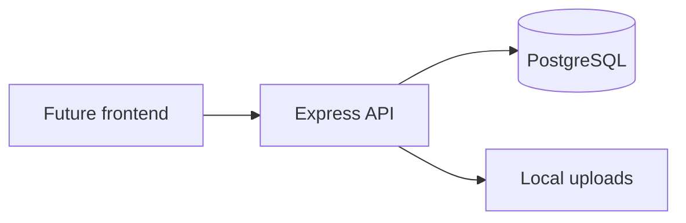

# PostBloom Architecture

## Overview

PostBloom is a **backend-first** hackathon MVP: Express 5 API + PostgreSQL, with a deferred React frontend.

## Request flow

`route → auth → RBAC → Zod validate → controller → service → repository → database`

Errors use `BackendError` and a global handler returning `{ error: { code, message, details? } }`.

## Modules

| Module | Responsibility |
|--------|----------------|
| Auth | JWT register/login/me |
| Workspaces | Team workspaces and RBAC membership |
| Analytics | LinkedIn XLSX import pipeline |
| Opportunities | Ranked feed + enrichment |
| Campaigns | Multi-platform deliverables, versions, review |
| Staffing | Campaign-level specialist requests (broadcast / first accept) |
| Notifications | In-app events |
| Audit | Workspace activity timeline |

## Opportunity scoring

Transparent relative scoring within each import cohort:

- Impressions, engagements, engagement rate, recency percentiles
- Weights redistributed when engagements are missing from the export
- Stored `score_breakdown` JSON for judge/demo transparency

## Workflow

Campaign and deliverable statuses use service-level transition guards (`domain/workflow.js`) with history rows in `*_status_history` tables.

## API documentation

Swagger UI at `/api/docs` — source of truth until `frontend/` is built.

## Future

- LinkedIn API connector (replace manual XLSX)
- BullMQ + Redis for async notifications
- Object storage for assets
- Separate frontend consuming OpenAPI
